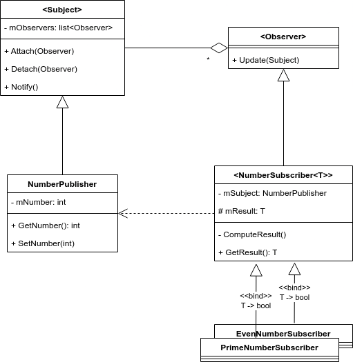
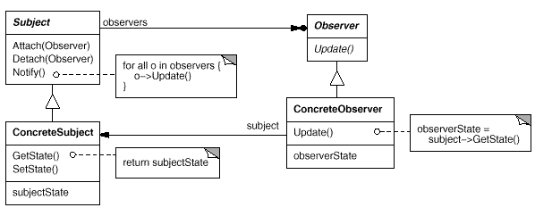

<!-- <style> -->
<!-- .markdown-body { -->
<!--     font-family: "Helvetica"; -->
<!-- } -->
<!-- .markdown-body code { -->
<!--     font-family: "Iosevka Extended"; -->
<!-- } -->
<!-- </style> -->

# SFRWENG 3A04: Assignment 1
**Author**: Luigi Quattrociocchi (quattrl)  
**Date**: March 27, 2023  


#### (a) Introduction
This repository showcases the **observer pattern**, a software design pattern in which an object, named the **subject**, maintains a list of its dependents, called **observers**, and notifies them automatically of any state changes, usually by calling one of their methods[^1]. The included code implements this pattern with a simple example.

Suppose (for some reason) that you want to know some qualities of some integers, such as primality or parity. Assuming that the logic for computing these qualities do not depend on each other, the modules responsible for the computation can be completely separate. Although the example is somewhat contrived, the observer pattern can be used to distribute the computation of each quality to its own module (or, observer).

#### (b) Design of system

Notable files inside the `src` directory include:
```
└── src
    ├── main.cpp                         │ Example usage
    │
    ├── Observer.hpp                     | Abstract observer
    ├── Subject.hpp/cpp                  | Abstract subject
    │
    ├── NumberPublisher.hpp              │ Concrete subject
    │
    ├── NumberSubscriber.hpp             │
    ├── EvenNumberSubscriber.hpp         │ Concrete observers
    └── PrimeNumberSubscriber.hpp        │
```

As shown in the class diagram, the `Subject` class has a list of `Observer`s. These observers are attached to the subject that is passed in the constructor of the observer, and detached from the subject in the destructor of the observer. These methods are public, so if the observation behaviour should not be tied to the lifetime of the object, then this can be changed.

The concrete subject and observer classes are templated on the input and output types. The input type is restricted to be an ingeral type (such as `short`, `int`, `long`, ...). The output type is not restricted, (the `EvenNumberSubscriber` and `PrimeNumberSubscriber` classes both return `bool`, but they could return anything).

The following diagram shows the structure of classes in `src`. The main file is omitted.



The following diagrams come from the famous book "Design Patterns: Elements of Reusable Object-Oriented Software"[^2], typically referred to as "The Gang of Four". Notice that the class diagram is nearly identical to the one above. The sequence diagram is also relevant to this design.




#### (c\) User guide

`src/main.cpp` has a fully commented example showing how to use the system. Pre-built binaries of this file are included: `A1.exe` (for Windows users) and `A1.out` (for Linux users). To run them, open the root directory of this repository in a terminal, then run the executable for your platform. If none of these options work for you, the build scripts can easily be modified (they are only a few lines long) to support other compilers (such as clang) and flags.

##### Windows (msvc)

Build:  
*NOTE: Run this from an MSVC enabled terminal (such as `Developer Command Prompt for VS 2022`)*
```console
> .\make.bat
```
Run:
```console
> .\A1.exe
```

##### Linux (gcc)

Build:
```console
$ ./make.sh
```
Run:
```console
$ ./A1.out
```

#### References:
[^1]: https://en.wikipedia.org/wiki/Observer_pattern
[^2]: https://archive.org/details/designpatternsel00gamm/page/293
